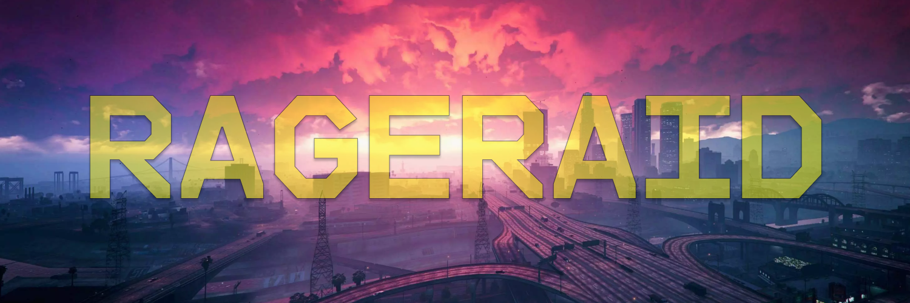

# RAGERAID

**RAIDRAGE** - это программа авто-помощник для GTA 5 RP, точнее RAGE MP. Автоматически 
нажимает в нужный тайминг на определённые клавиши. Добавлен Авто-бег и Поверх окон.

> Программа была разработана в целях тестирования безопасности RAGE MP против неправомерного
> использования софта для нечестной игры по отношению к другим пользователям, в целях 
> спортивно-развлекательного контента

## Предосмотр софта

## Установка
Переходите в Релизы и там всё будет

Распаковать архив, запустить файл "RAIDRAGE.exe"

Софт работает. Интуитивно всё доступно, имеются настройки для смены клавиш 
(ходить - W, ускорение - Shift).

### Как создать secret-key
В файле [secret_code.py](secret_code.py) заместо _HWID_ вставляете свой HWID. Число
после первого двоеточия - количество дней работоспособности secret-key. Число после
второго двоеточия - разные символы, можно заменить на буквы, на что угодно, оно было
добавлено для красоты и чтобы пользователя запустать с красивым secret-key.
После всех манипуляций запускаете скрипт. 

> То что вывело, это secret-key

## Используемые технологии
- **opencv-python** - машинное зрение
- **keyboard** - нажимать клавиши
- **PyAutoGUI** - делать скрины
- **PyQt6** - GUI софта
- **pyinstaller** - упаковать в .exe
- **PyCryptodome** - шифровка для _лицензии_

## The End
Хотел бы поблагодарить себя за то, что такой крутой и выложил и так бесплатный софт в 
сети Интернет